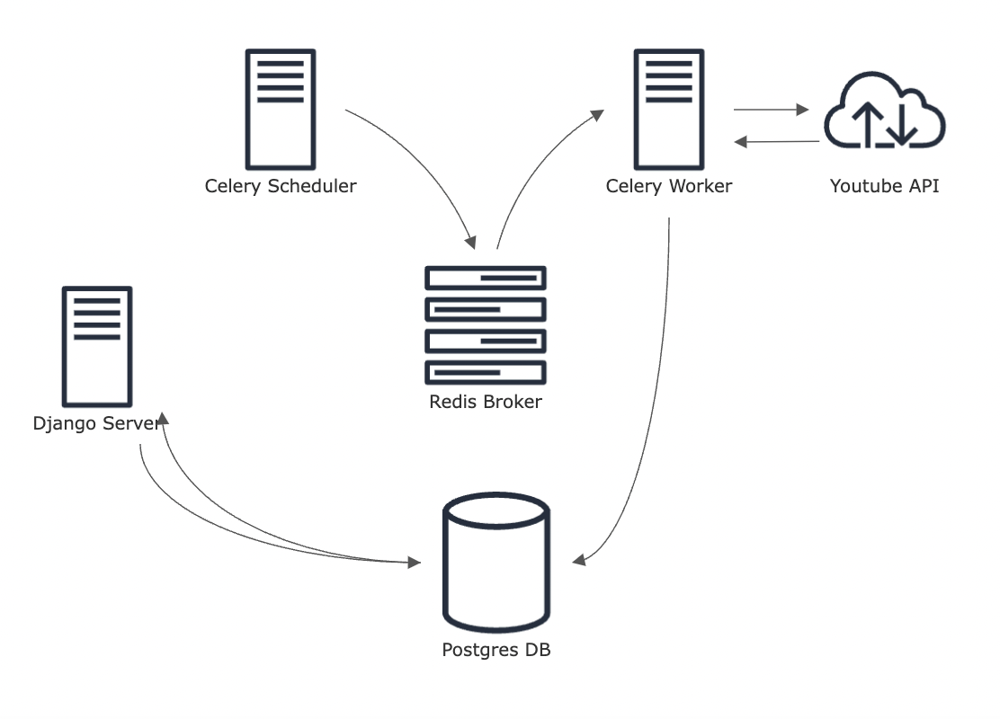

# Fampay Backend Assignment

### Requirements (Implemented)

☑️ Background service to load youtube video data periodically

☑️ A GET API which returns the stored video data in a paginated response sorted in descending order of published datetime.

☑️ Optimised search API that supports partial match on title and description

☑️ Dockerized the entire project

☑️ Support for multiple API keys implemented

☑️ Dashboard view available through django admin

### Setup Instructions

1.  The backend directory holds the code for the project , use the docker-compose.yml file to launch the project

```vhdl
docker compose build 
docker compose up
```

1.  Access the django admin at [localhost:3000/admin](http://localhost:3000/admin) , default username is _**ganesh**_ password is _**password.**_ You can add your api key in APIKey page for testing purpose.
2.  Make API requests to [localhost:3000/getvideos](http://localhost:3000/getvideos) and [localhost:3000/search](http://localhost:3000/search) by following the instructions here : [POSTMAN DOCS](https://documenter.getpostman.com/view/19494450/2s8Z6yXDSG)

### Implementation Details

- Background Service
    - I used celery for scheduling periodic task for fetching data from youtube API.
- GET Videos API
    - The API endpoint for fetching videos returns a paginated response.
    - Implemented pagination similiar to the youtube api , which takes a cursor such as publishedAfter and/or publishedBefore and paginates the response using page number (unlike youtube which uses a page token). The default page size in my API is 10.
    - Indexed publishedAt in order to support cursor pagintion.
- SEARCH API
    - In order to implement an optimised search , I took advantage of postgres full text search feature.
    - In django it is implemented using SearchVectors.
    - Used the GIN index to speed up queries even more.
    - SearchVector is populated using a trigger since it requirest the model fields to be already present.
- Support for multiple API keys
    - Added an APIKey model , by which api keys can be added through the dashboard.
- Dashboard for viewing data with sorting options , I took advantage of the existing django admin dashboard for this requirement. It can be accessed at the /admin endpoint.
### Design


